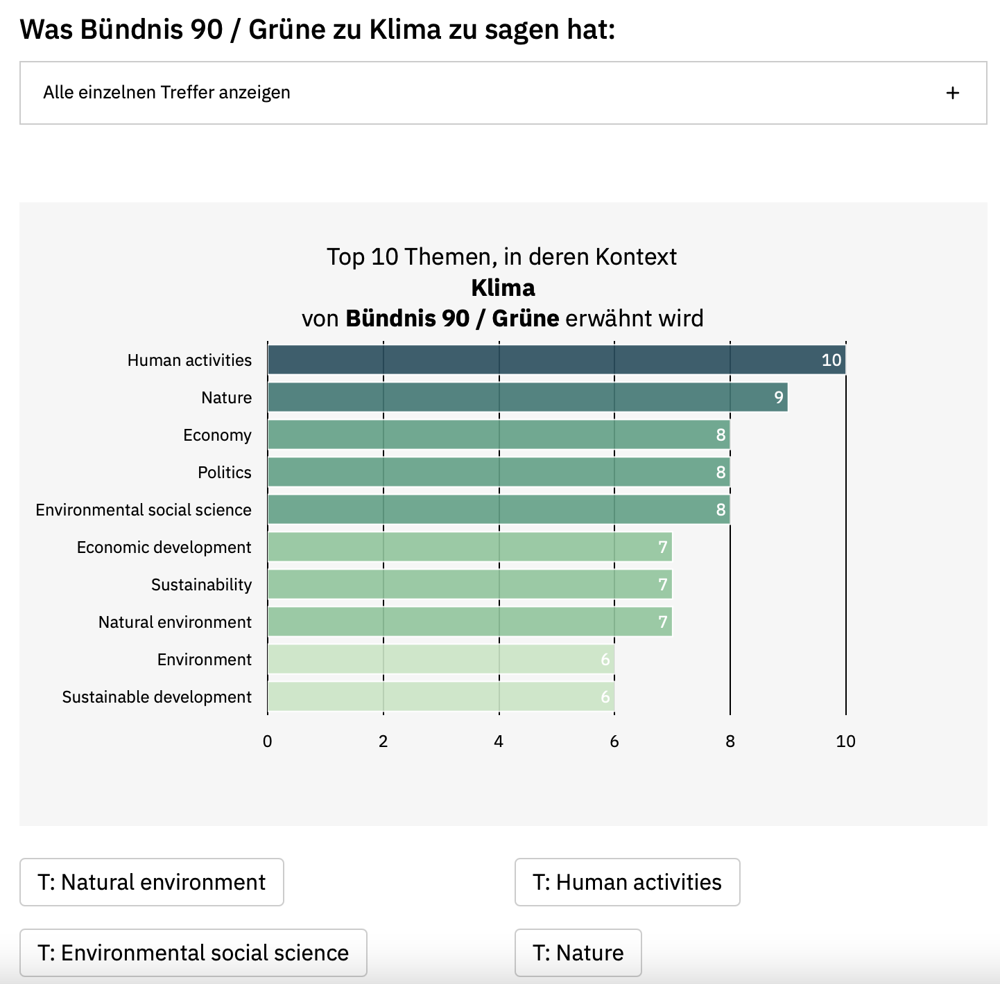

# Wahlprogramm Reader
This Streamlit app allows for executing concurrent searches against several electoral programs published by various German political parties in the run-up to the federal election on 2021-09-26.

## Setup
- In a new virtual environment, execute `pip install -r requirements.txt` to install all necessary packages, including Streamlit, Textrazor, PyMuPDF and Plotly.
- Obtain an API key from [Textrazor](https://www.textrazor.com) (free tier available as of 2021-09-18).
- Create an `.env` file in the root of your project and add `TEXTRAZOR=<your newly created API key>` to it.
- You can now run the app from the command line using `streamlit run main.py`   

## Features
- Search for an individual phrase of your interest. This phrase will be searched concurrently in all electoral programs.

- Select one of the parties with at least one match for your search phrase to display all relevant matches and to trigger a analysis of topics and entities within the context of these matches.
  - Due to the limited amount of daily requests included as part of the free tier of Textrazor, only 10 randomly selected matches will be analysed for topics and entities when selecting a party.

- The charts on topics and entities within the context of the matches for the search phrase can provide interesting insights into the various parties´ considerations.

- The feature to display either all matches for the selected party or just those matches relevant for a selected topic or entity allow for users of the app to dive deeper into the electoral programs and to come to their own understanding, without any bias inherent in summaries obtained from media outlets.

